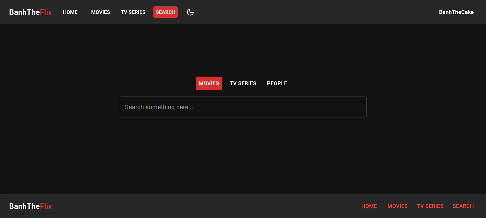
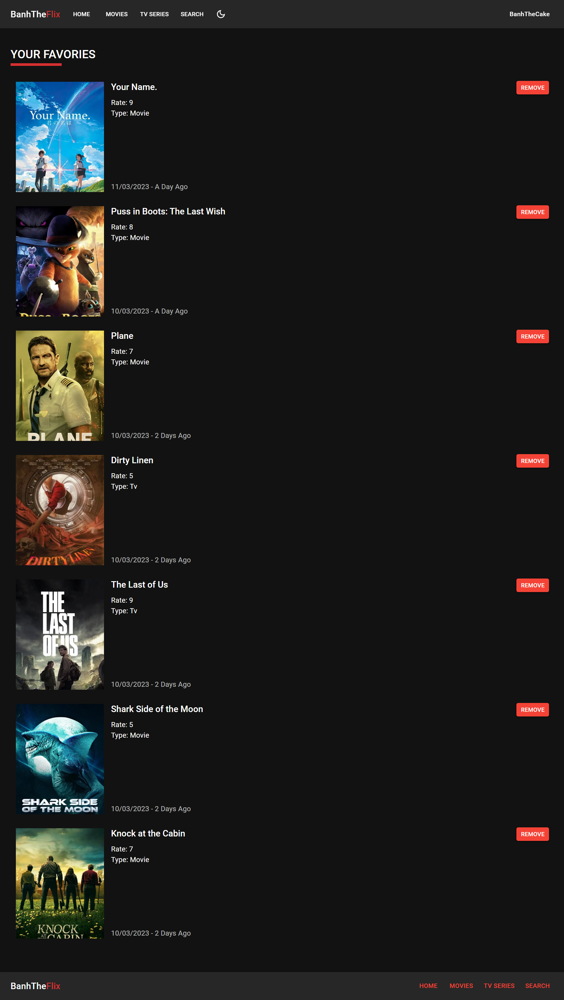
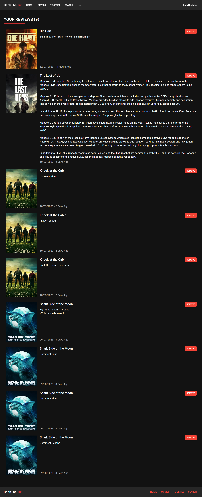
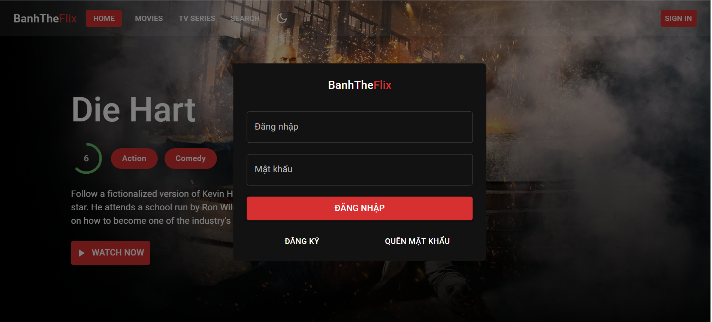

# Introduce

-   Website is remake from (https://www.youtube.com/watch?v=Q_uLi4f27Lc&t=12080s)
-   Frontend: NextJs
-   Backend: NestJs
-   Database: mysql (Sequelize)
-   UI/UX: material UI

# Features

-   Full responsive
-   Dark mode (Default)
-   Load more data
-   Authentication with JWT
-   Persist login - protected routes

# Preview

